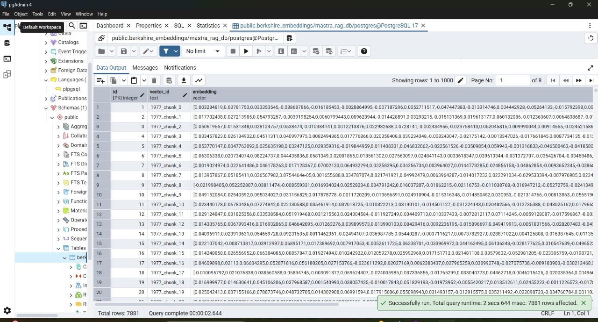

# 📊 Pazago Drive — RAG Backend using Mastra

This repository contains the backend implementation for the **Pazago RAG Assignment: Berkshire Hathaway Intelligence**, built using the [Mastra framework](https://docs.mastra.ai/). It utilizes OpenAI's GPT-4o model to create an intelligent RAG agent grounded in Berkshire Hathaway’s annual shareholder letters (2019–2024).

---

## 🙋 Author Information

- **Name:** Harshit Mhatre  
- **College ID:** TU8F2122024  

This repository is part of the backend assignment given as part of the Pazago Drive.

---

## ✅ Current Progress

### ✔️ Completed:
- ✅ Mastra Project Initialization
- ✅ Environment Configuration
- ✅ PDF Parsing for Shareholder Letters
- ✅ Embedding Generation via `text-embedding-3-small`
- ✅ Vector Storage using PostgreSQL + `pgvector`

📌 **PostgreSQL Table (`public.berkshire_embeddings`) Screenshot:**



---

### 🔜 Next Up:
- ⚙️ Building the **AI Agent**
- 💬 Adding memory, citations, and retrieval logic
- 🧠 Integrating Mastra tools for search

---

## 🛠️ Tech Stack

| Component         | Tool/Framework         |
|------------------|------------------------|
| Framework        | [Mastra](https://docs.mastra.ai) |
| Language         | TypeScript             |
| Embedding Model  | OpenAI `text-embedding-3-small` |
| LLM              | OpenAI GPT-4o          |
| Vector DB        | PostgreSQL + pgvector  |
| PDF Parsing      | `pdf-parse` (Node.js)  |

---

## 📚 Document Source

All shareholder letters (2019–2024) are downloaded from this [Google Drive folder](https://drive.google.com/drive/folders/1IdPSENw-efKI6S0QiMrSxk12YqxW3eRU) and parsed for embeddings.

---

## 🚀 How to Run

```bash
# Clone the repository
git clone https://github.com/xHarshit/Pazago-mastra-app-Harshit.git
cd Pazago-mastra-app-Harshit

# Install dependencies
npm install

# Setup environment
cp .env.example .env
# Fill in OpenAI API key and PostgreSQL credentials

# Parse all PDFs and extract raw text
npx tsx scripts/documentParser.ts

# Generate embeddings and store them in PostgreSQL
npx tsx scripts/documentIngestion.ts

# (In progress) Run the AI Agent
npx tsx berkshire-agent.ts
```

---

## 📌 Project Status

| Phase                          | Status         |
|-------------------------------|----------------|
| Mastra Setup                  | ✅ Complete     |
| Document Ingestion            | ✅ Complete     |
| Vector DB Integration         | ✅ Complete     |
| AI Agent Implementation       | 🔄 In Progress  |
| Frontend Chat UI              | ⏳ Pending      |

---

## 🎓 Assignment Goal

Build a production-ready RAG system that:
- Answers financial questions using real-time streaming
- Maintains conversation memory
- Cites exact shareholder letters
- Follows Mastra’s backend architecture
